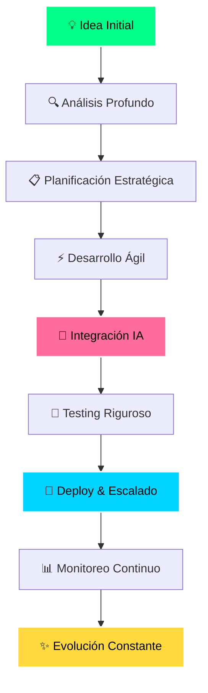

<!-- Banner Hero Animado -->

---

### 🌟 **Desarrollamos el futuro digital de tu empresa** 🌟

---

## 🎯 **NUESTRA MISIÓN**

> *Desarrollar **software inteligente, seguro y escalable**, integrando **inteligencia artificial** para automatizar procesos empresariales, optimizar recursos y potenciar la innovación tecnológica de nuestros clientes.*

---

## 🔮 **NUESTRA VISIÓN**

> *Ser reconocidos como **líderes globales en desarrollo de software con IA**, creando soluciones digitales que marquen tendencia y generen impacto positivo en los negocios a nivel mundial.*

---

## 🛠️ **NUESTROS SERVICIOS**

<table>
  <tr>
    <td align="center" width="25%">
      
       
      <h3><strong>📱 Apps Móviles</strong></h3>
      
<em>iOS & Android Nativas e híbridas</em>

      
    </td>
    <td align="center" width="25%">
      
       
      <h3><strong>🌐 Páginas Web</strong></h3>
      
<em>Adaptativas y escalables Experiencias digitales</em>

      
    </td>
  </tr>
  <tr>
    <td align="center" width="25%">
      
       
      <h3><strong>🤖 Automatización IA</strong></h3>
      
<em>Procesos empresariales Inteligencia artificial</em>

      
    </td>
    <td align="center" width="25%">
      
       
      <h3><strong>⚡ Soluciones Custom</strong></h3>
      
<em>A la medida Ágiles y seguras</em>

      
    </td>
  </tr>
</table>

---

## 📊 **ESTADÍSTICAS DE IMPACTO**

<table>
  <tr>
    <td align="center">
      
       
      
    </td>
    <td align="center">
      
       
      
    </td>
  </tr>
  <tr>
    <td align="center">
      
       
      
    </td>
    <td align="center">
      
       
      
    </td>
  </tr>
</table>

---

## ⚙️ **STACK TECNOLÓGICO**

### **Frontend Development**

### **Mobile Development**

### **Backend & AI**

### **Database & Cloud**

---

## 🚀 **PROCESO DE DESARROLLO**

---

## 💎 **NUESTROS VALORES**

| 🚀 **INNOVACIÓN** | 🤝 **COLABORACIÓN** | 🛡️ **SEGURIDAD** | ⚡ **AGILIDAD** |
|:--:|:--:|:--:|:--:|
| Creatividad constante | Trabajo en equipo | Protección total | Entrega rápida |
| **🌱 SOSTENIBILIDAD** | **🎨 CREATIVIDAD** | **🌍 EXCELENCIA** | **💪 COMPROMISO** |
| Desarrollo responsable | Diseño innovador | Calidad superior | Dedicación total |

---

## 🏆 **CASOS DE ÉXITO**

<table>
  <tr>
    <td align="center" width="33%">
      
       
      <strong>+300% Ventas</strong>
       
      <em>Automatización completa con IA</em>
    </td>
    <td align="center" width="33%">
      
       
      <strong>50K+ Usuarios</strong>
       
      <em>Diagnóstico por IA</em>
    </td>
    <td align="center" width="33%">
      
       
      <strong>$10M+ Procesados</strong>
       
      <em>Seguridad blockchain</em>
    </td>
  </tr>
</table>

---

## 🎯 **¿POR QUÉ ELEGIR AXON.APP?**

✅ **Experiencia comprobada** en más de 150 proyectos exitosos  
✅ **Metodologías ágiles** con entregas cada 2 semanas  
✅ **Integración de IA** en todos nuestros desarrollos  
✅ **Soporte 24/7** y mantenimiento continuo  
✅ **Escalabilidad garantizada** para el crecimiento de tu negocio  
✅ **Seguridad de primer nivel** con las mejores prácticas  
✅ **ROI comprobado** con métricas transparentes  

---

## 📞 **¡HABLEMOS DE TU PROYECTO!**

### 💬 **Canales de Contacto**

<table>
  <tr>
    <td align="center">
      
       <strong>Portafolio completo</strong>
    </td>
    <td align="center">
      
       <strong>Código abierto</strong>
    </td>
    <td align="center">
      
       <strong>Respuesta rápida</strong>
    </td>
  </tr>
</table>

---

### 🎯 **Respuesta garantizada en menos de 24 horas**

---

**🚀 En AXON.APP unimos tecnología e inteligencia artificial para construir el futuro digital 🌟**

*© 2024 Axon.app - Todos los derechos reservados*

