<!-- Banner Hero Dinámico -->

---

### 🌟 **Construimos soluciones robustas, seguras y escalables con las tecnologías más modernas del mercado** 🌟

---

## 📊 **ESTADÍSTICAS DE NUESTROS PROYECTOS**

<table>
  <tr>
    <td align="center" width="25%">
      
       
      
       
      <strong>📱 Apps Móviles: 85+</strong> 
      <strong>🌠Sitios Web: 75+</strong> 
      <strong>🤖 Automatizaciones IA: 40+</strong>
    </td>
    <td align="center" width="25%">
      
       
      
       
      <strong>⭐ Rating Promedio: 4.9/5</strong> 
      <strong>🔄 Clientes Recurrentes: 85%</strong> 
      <strong>📈 Recomendaciones: 92%</strong>
    </td>
    <td align="center" width="25%">
      
       
      
       
      <strong>⚡ Entrega Rápida: 90%</strong> 
      <strong>🯠A Tiempo: 95%</strong> 
      <strong>💰 Dentro Presupuesto: 92%</strong>
    </td>
    <td align="center" width="25%">
      
       
      
       
      <strong>💹 Aumento Ventas: +280%</strong> 
      <strong>⏱️ Ahorro Tiempo: 65%</strong> 
      <strong>💸 Reducción Costos: 45%</strong>
    </td>
  </tr>
</table>

---

## 🛠️ **NUESTROS SERVICIOS ESPECIALIZADOS**

### 📱 **Aplicaciones Móviles**
> Desarrollamos apps nativas e híbridas para iOS y Android con diseño intuitivo y alto rendimiento.

   

### 🌐 **Desarrollo Web**
> Sitios web modernos, rápidos y escalables usando React, Vue, Node.js, Next.js y más.

   

### ⚙️ **Software a Medida**
> Sistemas empresariales personalizados que automatizan procesos y aumentan la productividad.

   

### ☁️ **Cloud & DevOps**
> Implementamos soluciones en la nube (AWS, Azure) y pipelines CI/CD para despliegue continuo.

   

### 🎨 **UX/UI Design**
> Diseñamos interfaces intuitivas y centradas en el usuario para mejorar la experiencia.

  

### 💡 **Consultoría Tech**
> Asesoramos en arquitectura, stack tecnológico y estrategia digital para tu negocio.

---

## 🤖 **AUTOMATIZACIÓN DE PROCESOS EMPRESARIALES CON IA**

### 🧠 **Integración de IA**
Incorporamos inteligencia artificial para automatizar tareas y mejorar decisiones empresariales.

**📈 Casos de Uso Implementados:**
- **Chatbots inteligentes** para atención al cliente 24/7
- **Análisis predictivo** de ventas y comportamiento del usuario  
- **Procesamiento de documentos** y extracción automática de datos
- **Recomendaciones personalizadas** basadas en ML
- **Detección de fraudes** y análisis de riesgos en tiempo real
- **Automatización de workflows** y procesos administrativos

### 🛠️ **Mantenimiento y Soporte**
Soporte técnico continuo y actualizaciones para mantener tu software siempre optimizado.

**🔧 Servicios de Soporte:**
- Monitoreo 24/7 de sistemas críticos
- Actualizaciones de seguridad automáticas
- Backup y recuperación de datos
- Optimización de rendimiento continua
- Soporte técnico especializado

### 🏢 **Aplicaciones para Empresas**
Soluciones ERP, CRM y herramientas internas para mejorar la gestión empresarial.

**💼 Soluciones Empresariales:**
- Sistemas ERP personalizados
- CRM con automatización de ventas
- Plataformas de gestión de inventarios
- Herramientas de Business Intelligence
- Sistemas de gestión de recursos humanos

---

## 💎 **NUESTROS VALORES CORPORATIVOS**

<table>
  <tr>
    <td align="center" width="25%">
      
       
      <em>Adoptamos las últimas tecnologías y metodologías para crear soluciones vanguardistas</em>
    </td>
    <td align="center" width="25%">
      
       
      <em>Trabajamos de la mano con nuestros clientes como parte de su equipo</em>
    </td>
    <td align="center" width="25%">
      
       
      <em>Implementamos las mejores prácticas de seguridad en cada línea de código</em>
    </td>
    <td align="center" width="25%">
      
       
      <em>Metodologías ágiles que garantizan entregas rápidas y de calidad</em>
    </td>
  </tr>
  <tr>
    <td align="center" width="25%">
      
       
      <em>Código limpio, eficiente y sostenible para un futuro mejor</em>
    </td>
    <td align="center" width="25%">
      
       
      <em>Interfaces únicas que destacan y generan experiencias memorables</em>
    </td>
    <td align="center" width="25%">
      
       
      <em>Estándares de calidad internacionales en cada proyecto</em>
    </td>
    <td align="center" width="25%">
      
       
      <em>Compromiso absoluto con el éxito de tu proyecto y negocio</em>
    </td>
  </tr>
</table>

---

## 🔧 **TECNOLOGÍAS QUE DOMINAMOS**

### **Frontend Development**

### **Backend Development**

### **Databases & Cloud**

### **DevOps & Tools**

---

## 🏆 **CASOS DE ÉXITO DESTACADOS**

<table>
  <tr>
    <td align="center" width="33%">
      
       
      <h3>**+380% Incremento en Ventas**</h3>
      
Automatización completa con IA predictiva, chatbot inteligente y sistema de recomendaciones personalizado

      
    </td>
    <td align="center" width="33%">
      
       
      <h3>**75K+ Usuarios Activos**</h3>
      
Plataforma de telemedicina con diagnóstico por IA, historial médico digital y sistema de citas inteligente

      
    </td>
    <td align="center" width="33%">
      
       
      <h3>**$25M+ Transacciones**</h3>
      
Plataforma de pagos con blockchain, detección de fraudes por ML y KYC automatizado

      
    </td>
  </tr>
</table>

---

## 🚀 **PROCESO DE DESARROLLO ÁGIL**

```mermaid
graph LR
    A[💡 Ideación] --> B[🔍 Análisis]
    B --> C[📋 Planificación]
    C --> D[🎨 Diseño UX/UI]
    D --> E[⚡ Desarrollo]
    E --> F[🤖 Integración IA]
    F --> G[🧪 Testing QA]
    G --> H[🚀 Deploy]
    H --> I[📊 Monitoreo]
    I --> J[🔄 Iteración]
    
    style A fill:#FF6B9D,stroke:#fff,stroke-width:2px,color:#000
    style F fill:#4A90E2,stroke:#fff,stroke-width:2px,color:#000
    style H fill:#38A169,stroke:#fff,stroke-width:2px,color:#000
    style J fill:#F6AD55,stroke:#fff,stroke-width:2px,color:#000
```

### 📅 **Metodología Scrum Personalizada**
- **Sprints de 2 semanas** con entregas incrementales
- **Daily standups** para seguimiento continuo  
- **Demos semanales** con el cliente para validación
- **Retrospectivas** para mejora continua del proceso

---

## 📞 **¡CONVERSEMOS SOBRE TU PROYECTO!**

### 💬 **Múltiples Canales de Comunicación**

<table>
  <tr>
    <td align="center">
      
       <strong>Explora nuestro trabajo</strong>
    </td>
    <td align="center">
      
       <strong>Revisa nuestros proyectos</strong>
    </td>
    <td align="center">
      
       <strong>Conversemos tu proyecto</strong>
    </td>
  </tr>
</table>

---

### 🎯 **Garantías de Servicio**

### 🌐 **Síguenos en Redes**

---

**🚀 En AXON.APP transformamos ideas en realidades digitales que impulsan el crecimiento de tu negocio 🌟**

*Trabajamos con las tecnologías más modernas y demandadas del mercado para construir soluciones robustas, seguras y escalables.*

---

*© 2024 Axon.app - Todos los derechos reservados | Hecho con ❤️ y mucho ☕*

