<!-- Banner Hero Dinámico con Animación -->

<!-- Nueva Sección de Estadísticas con Diseño Premium -->

  

<!-- Nueva Sección de Badges Animados -->

  

<!-- Efecto de Partículas -->

<!-- Badge Dinámico de Status -->

<!-- Banner Animado Principal -->

<!-- Nuevos Indicadores Animados -->

  
  
  

    
    
    
  

  <!-- Stats en Tiempo Real -->
  

    
    
    
  

---

### 🌟 **Construimos soluciones robustas, seguras y escalables con las tecnologías más modernas del mercado** 🌟

<!-- Nueva Sección de Highlights Animados -->

  
  
  

---

## 📊 **MÉTRICAS DE IMPACTO**

### � **Métricas de Excelencia**

<table style="background: transparent; border: none;">
<tr>
<td align="center" width="25%">

<h3>🚀 Proyectos Elite</h3>

  

 

 

</td>
<td align="center" width="25%">

<h3>💫 Satisfacción</h3>

  

 

 

</td>
<td align="center" width="25%">

<h3>⚡ Eficiencia</h3>

  

 

 

</td>
<td align="center" width="25%">

<h3>📈 Impacto</h3>

  

 

 

</td>
</tr>
</table>

<!-- TIEMPO -->

  <h3>
    
  </h3>
  
  

<!-- ROI -->

  <h3>
    
  </h3>
  
  

---

## � **Soluciones Elite**

<!-- Desarrollo Móvil Premium -->

<h3>📱 Desarrollo Móvil Elite</h3>

Aplicaciones nativas y cross-platform de alto rendimiento

 

<!-- Desarrollo Web Premium -->

<h3>🌐 Desarrollo Web Avanzado</h3>

Plataformas web de última generación y alto impacto

 

<!-- IA & Machine Learning Premium -->

<h3>🤖 IA & Machine Learning</h3>

Soluciones inteligentes con tecnología de punta

 

<!-- Cloud & DevOps Premium -->

<h3>☁️ Cloud & DevOps Elite</h3>

Infraestructura escalable y automatización avanzada

 

<!-- Diseño UX/UI Premium -->

<h3>🎨 Diseño UX/UI Premium</h3>

Experiencias digitales únicas y memorables

 

<!-- Consultoría Tech Premium -->

<h3>💡 Consultoría Estratégica</h3>

Transformación digital y optimización de procesos

 

---

## 🤖 **AUTOMATIZACIÓN DE PROCESOS EMPRESARIALES CON IA**

### 🧠 **Integración de IA — Soluciones con impacto medible**
Aplicamos modelos de Machine Learning y pipelines de automatización para transformar procesos operativos en ventajas competitivas. A continuación verás indicadores clave (badges fiables) y tendencias (gráficas pequeñas) que reflejan resultados reales.

<!-- Contadores principales con badges (estables) -->
<table>
  <tr>
    <td align="center" width="25%">
      
       
      
    </td>
    <td align="center" width="25%">
      
       
      
    </td>
    <td align="center" width="25%">
      
       
      
    </td>
    <td align="center" width="25%">
      
       
      
    </td>
  </tr>
  <tr>
    <td colspan="4" align="center" style="padding-top:10px;">
      <em>Los indicadores anteriores resumen resultados reales de implementaciones con IA: mayor productividad, reducción de errores y mejora sustancial del retorno.</em>
    </td>
  </tr>
</table>

---

### 🧩 Casos de Uso Implementados (resumen técnico)
- Chatbots conversacionales y asistentes virtuales (NLP + diálogo multicanal)
- Modelos predictivos para ventas y churn (time-series y clasificación)
- OCR y extracción automática de datos (pipelines ETL para documentos)
- Recomendaciones personalizadas (embeddings y sistemas de filtrado híbrido)
- Detección de fraude en tiempo real (streaming + modelos de scoring)
- Automatización de workflows y RPA con orquestación segura

### �️ Mantenimiento y Soporte
- Monitoreo 24/7 y alerting en infraestructura crítica
- Actualizaciones y retraining programado de modelos ML
- Backups, recuperación y controles de seguridad
- SLA y soporte técnico especializado

### 🏢 Aplicaciones para Empresas
- Plataformas ERP/CRM con módulos de automatización inteligente
- Dashboards de BI y pipelines de datos para decisiones accionables
- Integración segura con sistemas legacy y APIs externas

## 💎 **NUESTROS VALORES CORPORATIVOS**

<table>
  <tr>
    <td align="center" width="25%">
      
       
      <em>Adoptamos las últimas tecnologías y metodologías para crear soluciones vanguardistas</em>
    </td>
    <td align="center" width="25%">
      
       
      <em>Trabajamos de la mano con nuestros clientes como parte de su equipo</em>
    </td>
    <td align="center" width="25%">
      
       
      <em>Implementamos las mejores prácticas de seguridad en cada línea de código</em>
    </td>
    <td align="center" width="25%">
      
       
      <em>Metodologías ágiles que garantizan entregas rápidas y de calidad</em>
    </td>
  </tr>
  <tr>
    <td align="center" width="25%">
      
       
      <em>Código limpio, eficiente y sostenible para un futuro mejor</em>
    </td>
    <td align="center" width="25%">
      
       
      <em>Interfaces únicas que destacan y generan experiencias memorables</em>
    </td>
    <td align="center" width="25%">
      
       
      <em>Estándares de calidad internacionales en cada proyecto</em>
    </td>
    <td align="center" width="25%">
      
       
      <em>Compromiso absoluto con el éxito de tu proyecto y negocio</em>
    </td>
  </tr>
</table>

---

## 🌟 **Stack Tecnológico Elite**

<!-- Frontend Technologies Premium Section -->

### 🎨 **Frontend Development Excellence**

<!-- Core Technologies -->

<h4>🛠️ Core Technologies</h4>

<!-- Modern Frameworks -->

<h4>🚀 Modern Frameworks</h4>

<!-- Next Generation -->

<h4>💫 Next Generation</h4>

<!-- Performance Metrics -->

<h4>⚡ Performance</h4>

<h4>♿ Accessibility</h4>

<h4>🎯 Best Practices</h4>

<!-- Backend & Infrastructure Premium Section -->

### ⚡ **Backend & Infrastructure Excellence**

<!-- Backend Core -->

<h4>🔥 Backend Core</h4>

<!-- Cloud Services -->

<h4>☁️ Cloud Services</h4>

<!-- DevOps Tools -->

<h4>🔄 DevOps Tools</h4>

<!-- Infrastructure Metrics -->

<h4>🔒 Security</h4>

<h4>⚡ Performance</h4>

<h4>🔄 Reliability</h4>

<h4>📈 Scalability</h4>

### **DevOps & Tools**

---

## 🏆 **CASOS DE ÉXITO DESTACADOS**

<!-- Separador dinámico -->

<!-- Nuevo diseño de casos de éxito con iconos animados -->
<table>
  <tr>
    <td align="center" width="33%">
      <a href="#" style="text-decoration: none;">
  
         
  <h3></h3>
        
Automatización completa con IA predictiva, chatbot inteligente y sistema de recomendaciones personalizado

        
      </a>
    </td>
  <td align="center" width="33%">
  
       
      <h3>**75K+ Usuarios Activos**</h3>
      
Plataforma de telemedicina con diagnóstico por IA, historial médico digital y sistema de citas inteligente

  
    </td>
  <td align="center" width="33%">
  
       
      <h3>**$25M+ Transacciones**</h3>
      
Plataforma de pagos con blockchain, detección de fraudes por ML y KYC automatizado

  
    </td>
  </tr>
</table>

---

## 🚀 **PROCESO DE DESARROLLO ÁGIL**

```mermaid
graph LR
    A[💡 Ideación] --> B[🔍 Análisis]
    B --> C[📋 Planificación]
    C --> D[🎨 Diseño UX/UI]
    D --> E[⚡ Desarrollo]
    E --> F[🤖 Integración IA]
    F --> G[🧪 Testing QA]
    G --> H[🚀 Deploy]
    H --> I[📊 Monitoreo]
    I --> J[🔄 Iteración]
    
    style A fill:#FF6B9D,stroke:#fff,stroke-width:2px,color:#000
    style F fill:#4A90E2,stroke:#fff,stroke-width:2px,color:#000
    style H fill:#38A169,stroke:#fff,stroke-width:2px,color:#000
    style J fill:#F6AD55,stroke:#fff,stroke-width:2px,color:#000
```

### 📅 **Metodología Scrum Personalizada**
- **Sprints de 2 semanas** con entregas incrementales
- **Daily standups** para seguimiento continuo  
- **Demos semanales** con el cliente para validación
- **Retrospectivas** para mejora continua del proceso

---

## 🌟 **Elevemos Tu Proyecto al Siguiente Nivel**

### 💫 **Canales de Comunicación Premium**

<!-- Website Card -->

<a href="https://axon-app.github.io/Axon.app/" style="text-decoration: none;">
<h3>🌐 Portafolio Digital</h3>

Descubre nuestras soluciones innovadoras y casos de éxito

</a>

<!-- Email Card -->

<a href="mailto:contacto@axon.app" style="text-decoration: none;">
<h3>📧 Contacto Directo</h3>

Conversemos sobre tu visión y cómo hacerla realidad

</a>

<!-- GitHub Card -->

<a href="https://github.com/Axon-app" style="text-decoration: none;">
<h3>📁 GitHub</h3>

Explora nuestras contribuciones y desarrollos

</a>

### ⭐ **Garantías Premium**

<h3>⚡ Respuesta Inmediata</h3>

Atención personalizada y ágil

<h3>💎 Consulta Premium</h3>

Análisis profundo de tu proyecto

<h3>🎯 Presupuesto Elite</h3>

Soluciones adaptadas a tu medida

### 🌐 **Redes Sociales Premium**

---

**💫 Innovación + Excelencia + Resultados = AXON.APP**

*Creando soluciones digitales que trascienden expectativas y definen el futuro*

*© 2024 Axon.app - Todos los derechos reservados | Creado con 💎 y Excelencia*

